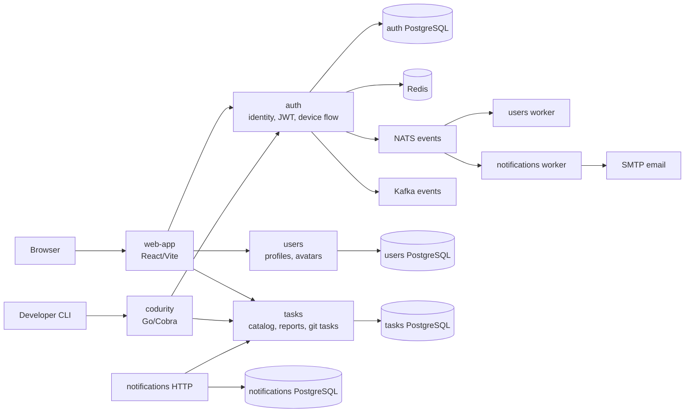

# Codurity Code Examples

Codurity - набор code examples из микросервисного проекта для платформы security-практики. В репозитории собраны backend-сервисы на Go, CLI-инструмент и React/Vite frontend, которые вместе покрывают регистрацию, профиль пользователя, каталог задач, запуск git-based заданий, отчеты и email-уведомления.

## Оглавление

- [Архитектура](#архитектура)
- [Сервисы](#сервисы)
- [auth](#auth)
- [codurity](#codurity)
- [notifications](#notifications)
- [tasks](#tasks)
- [users](#users)
- [web-app](#web-app)
- [Быстрый запуск](#быстрый-запуск)
- [Что показывает проект](#что-показывает-проект)

## Архитектура



Проект разделен на независимые сервисы. HTTP-трафик в локальном Docker-окружении маршрутизируется через Traefik по `codurity.ai` и path-based rules. Событийная часть построена вокруг NATS: `auth` публикует события identity и email-code flows, `users` и `notifications` обрабатывают их воркерами. В `auth` также есть Kafka publisher как альтернативный event transport.

## Сервисы

| Папка | Назначение | Основной стек |
| --- | --- | --- |
| `auth` | Регистрация, логин, JWT/refresh sessions, device flow для CLI, смена email/пароля, удаление аккаунта | Go, Echo, PostgreSQL, Redis, NATS, Kafka |
| `codurity` | CLI для аутентификации, получения задач и клонирования репозиториев | Go, Cobra, Viper |
| `notifications` | Email-уведомления и просмотр CI/report данных, webhook endpoint | Go, Echo, PostgreSQL, Redis, NATS, SMTP |
| `tasks` | Каталог задач, метаданные задач, выдача git-ссылок, прием и чтение отчетов | Go, Echo, PostgreSQL, OpenAPI |
| `users` | Профиль пользователя, аватары, настройки, синхронизация identity events | Go, Echo, PostgreSQL, NATS |
| `web-app` | Пользовательский интерфейс: auth flow, профиль, задачи, sandbox и отчеты | React, TypeScript, Vite, TanStack Query |

## auth

`auth` отвечает за identity layer. В сервисе реализованы регистрация с кодом подтверждения, login/logout, refresh tokens, `/auth/me`, смена пароля, восстановление пароля, смена email, удаление аккаунта и device authorization flow для CLI.

Ключевые части:

- `internal/services/auth` - бизнес-логика auth flows.
- `internal/repository/postgres` - identities, credentials, sessions, verification codes и token tables.
- `internal/repository/redis` - rate limiting и временные verification states.
- `internal/repository/nats` и `internal/repository/kafka` - публикация domain events.
- `typespec` и `openapi/openapi.yaml` - контракт API.

Основные endpoints: `/auth/register`, `/auth/register/verify`, `/auth/login`, `/auth/logout`, `/auth/refresh`, `/auth/me`, `/auth/password/*`, `/auth/me/email/change/*`, `/auth/device/*`.

Подробнее: [auth/README.md](auth/README.md)

## codurity

`codurity` - консольный клиент для пользователя платформы. Он умеет логиниться через device flow, хранить локальный token, показывать auth status, получать задачу по имени и клонировать GitHub-репозиторий.

Ключевые команды:

- `codurity auth login`
- `codurity auth status`
- `codurity auth logout`
- `codurity get <task_name>`
- `codurity clone <owner/repo>`
- `codurity version`

Подробнее: [codurity/README.md](codurity/README.md)

## notifications

`notifications` закрывает коммуникационный слой. HTTP-часть отдает данные по reports и принимает webhook, а worker подписывается на NATS events вида `notification.email.*.send` и отправляет письма через SMTP.

Ключевые части:

- `internal/worker/consumer` - идемпотентная обработка NATS-сообщений.
- `internal/templates` - HTML/text/MJML шаблоны email.
- `internal/repository/mailer` и `pkg/mailer` - отправка писем.
- `internal/services/ci_report` и `internal/services/report` - работа с отчетами.

Подробнее: [notifications/README.md](notifications/README.md)

## tasks

`tasks` хранит каталог заданий и отчеты. Сервис отдает список задач, языки и теги, детальную карточку задания, git metadata для CLI, а также принимает и возвращает CI/report данные.

Ключевые endpoints: `/tasks`, `/tasks/{task_id}`, `/tasks/{task_name}/git`, `/tasks/languages`, `/tasks/tags`, `/reports`, `/reports/{reportId}`.

Подробнее: [tasks/README.md](tasks/README.md)

## users

`users` хранит профиль пользователя и публичные данные вокруг identity. В сервисе есть HTTP API для профиля, аватаров и настроек, а также worker, который слушает `identity.created`, `identity.updated`, `identity.deleted` и синхронизирует профильную модель.

Ключевые endpoints: `/profile/me`, `/profile/me/avatar`, `/profile/me/settings`, `/git-user/me`.

Подробнее: [users/README.md](users/README.md)

## web-app

`web-app` - frontend приложения. Он реализует auth screens, protected routes, профиль, настройки безопасности, список задач, страницу задачи, sandbox и просмотр CI-отчетов с polling для pending-состояний.

Ключевые страницы: `/login`, `/register`, `/verify`, `/profile`, `/settings/profile`, `/settings/security`, `/tasks`, `/tasks/:taskId`, `/sandbox`, `/sandbox/tasks/reports/:reportId`, `/cli/login`.

Подробнее: [web-app/README.md](web-app/README.md)

## Быстрый запуск

Каждый сервис можно запускать отдельно. Для Go-сервисов используется `Taskfile.yml`, Docker Compose и `.env.example`.

Типовой порядок для backend-сервиса:

```bash
cp .env.example .env
task create-network
task deploy
task goose -- up
```

Для остановки:

```bash
task stop
```

Для фронтенда:

```bash
bun install
bun run dev
```

Для CLI:

```bash
cp .env.example .env
task build
./codurity version
```

Перед реальным деплоем sample secrets из `.env.example` нужно заменить на собственные значения.

## Что показывает проект

- Разделение backend на независимые сервисы с собственными БД и контрактами.
- REST API на Go/Echo с OpenAPI/TypeSpec и generated handlers.
- JWT auth, refresh sessions, verification code flows и device login для CLI.
- Event-driven интеграции через NATS, идемпотентные воркеры и отдельные processed events tables.
- Docker-based local development через Taskfile, Traefik и docker-compose.
- Frontend на React/TypeScript с feature-sliced структурой, typed API client и protected routes.
- Интеграционные и e2e-тесты с testcontainers в Go-сервисах.
